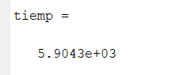

# TFG
# Propagación de errores en medidas indirectas: comparación de métodos analíticos y métodos numéricos

## Descripción

Este repositorio de GitHub contiene todo el código de MATLAB creado y empleado para la realización del TFG, así como algunos de los resultados. 

### Índice
You're sections headers will be used to reference location of destination.

- [Cálculo de g con un péndulo](#cálculo-de-g)
- [Área y volumen de un cilindro](#Área-y-volumen-de-un-cilindro)
- [ρ=0](#ρ=0)
- [License](#license)
- [Author Info](#author-info)

---

## Cálculo de g 
Como se detalla en el TFG, este primer caso se abordó de dos maneras: una fue de la manera ortodoxa de realizar la simulación de Montecarlo que se describe en la introducción del trabajo, es decir,
obteniendo un resultado de N^m dimensiones. Debido al coste computacional esto se implementó con un número bajo de puntos y empleando computación paralela en Matlab,
haciendo uso de la GPU de mi ordenador personal.\
 
- El código de este caso es [pendulo_gpu.m](pendulo_gpu.m)

Y los resultados se pueden ver en esta [imagen](tiempo2.PNG) y el tiempo de computación fue:

 

Por otra parte, se procedió en el resto del trabajo a emplear un método de Montecarlo modificado de manera que el resultado fuera de dimension NxM y los tiempos de computación
fueran razonables.

- El código que emplea este método para el caso del péndulo es [pendulo.m](pendulo.m) 

[Back To The Top](#tfg)

---

## Área y volumen de un cilindro

#### ρ=0
#### ρ=1
#### ρ=0.5

## References
[Back To The Top](#read-me-template)

---

## Autor

- Jorge Mifsut Benet [jormifbe@alumni.uv.es](mailto:jormifbe@alumni.uv.es)

[Back To The Top](#read-me-template)
